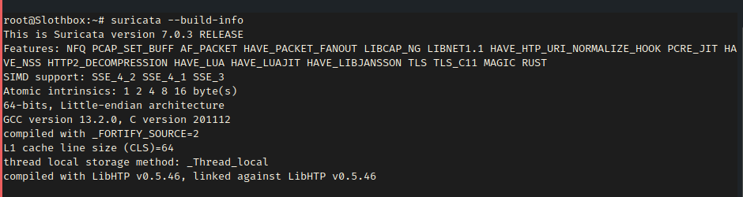

# Suricata IPS Project

## Overview
This project demonstrates how to deploy and configure Suricata as an Intrusion Prevention System (IPS) on Ubuntu 22.04. It covers installation, custom rule creation, attack simulation, and log analysis. Follow the steps below to set up the system and verify its functionality.

## Objectives
- Install and configure Suricata on Ubuntu.
- Develop custom rules for detecting ICMP and SSH brute-force attacks.
- Simulate network attacks to trigger the custom rules.
- Analyze Suricata logs to confirm threat detection.

## Prerequisites
- Ubuntu 22.04
- Sudo privileges
- Basic CLI knowledge

## Installation and Setup

1. **Update and Install Suricata:**
   ```bash
   sudo apt update && sudo apt install -y suricata
2. Verify the Installation
    ```bash
   suricata --build-info | grep "Suricata Version"


3. Enable and Check the 
