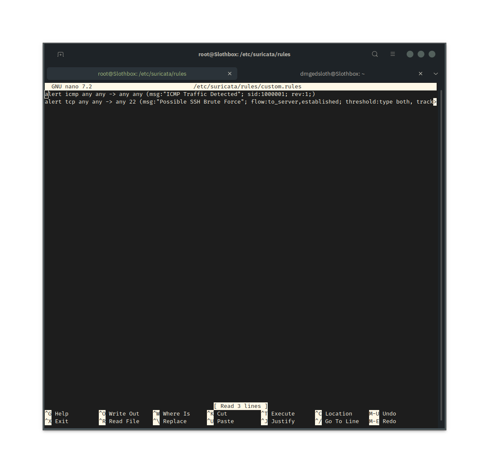
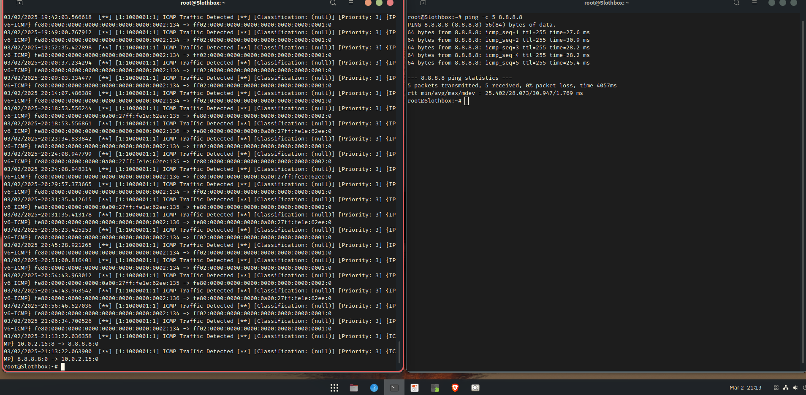

### 🚀 Suricata IPS Project

## 📝 Overview
This project demonstrates how to deploy and configure Suricata as an Intrusion Detection System (IDS) on Ubuntu 22.04. It covers installation, custom rule creation, attack simulation, and log analysis. Follow the steps below to set up the system and verify its functionality.

## 🎯 Objectives
- Install and configure Suricata on Ubuntu.
- Develop custom rules for detecting ICMP and SSH brute-force attacks.
- Simulate network attacks to trigger the custom rules.
- Analyze Suricata logs to confirm threat detection.

## 🛠️ Tools and Technologies

- **Operating System:** Ubuntu 22.04
- **IDS/IPS Engine:** Suricata
- **Utilities:** `ping`, `ssh`
- **Log Files:** `fast.log`
- **Editors:** Nano, Vim
- **Scripting:** Bash

## ⚙️ Installation and Setup

1. **Update and Install Suricata:**
   ```bash
   sudo apt update && sudo apt install -y suricata
2. Verify the Installation:
    ```bash
   suricata --build-info | grep "Suricata Version"


3. Enable and Check the Suricata Service:
    ```
    sudo systemctl enable --now suricata
    sudo systemctl status suricata


4. Configure Suricata for Network Traffic Capture: Edit the Suricata configuration file:
   ```
   sudo nano /etc/suricata/suricata.yaml
Ensure the following configuration is present (under the af-packet: section):
```
af-packet:
   - interface: enp0s3
      cluster-id: 99
      cluster-type: cluster_flow         
```
   
(Note: Make sure you are using correct interface. Use ip -a to find correct interface)


## Adding Custom Detection Rules

1. Include Custom Rules in the Suricata Configuration: Edit the configuration file:
   ```
   sudo nano /etc/suricata/suricata.yaml
   ```
Under the rule-files: section, add:
   ```
rule-files:
  - /etc/suricata/rules/custom.rules
   ```

2. Create the Custom Rules File:
```
cd /etc/surictaa/rules
sudo nano custom.rules
```
Add these rules to custom.rules:
* INCMP Detection Rule:
```
echo 'alert icmp any any -> any any (msg:"ICMP Traffic Detected"; sid:1000001; rev:1;)' | sudo tee -a custom.rules
```
* SSH Brute Force Detection Rule:
```
echo 'alert tcp any any -> any 22 (msg:"Possible SSH Brute Force"; flow:to_server,established; threshold:type both, track by_src, count 5, seconds 10; sid:1000002; rev:1;)' | sudo tee -a custom.rules
```
  

## Testing Suricata Configuration
1. Validate the Configuration:
```
sudo suricata -T -c /etc/suricata/suricata.yaml
```
  

## Attack Simulation and Log Analysis
1. Simulate an ICMP (Ping) Attack:
```
ping -c 5 8.8.8.8
```
Then check the Suricata log for ICMP alerts:
```
sudo cat /var/log/suricata/fast.log | grep "ICMP Traffic Detected"
```
  
2. Simulate an SSH Brute Force Attack:
```
for i in {1..6}; do ssh user@localhost; done
```
After the simulation, verify SSH brute force alerts by running:
```
sudo cat /var/log/suricata/fast.log
```
  

## 📊 Findings and Conclusion

* Suricata successfully detected ICMP and SSH brute-force attempts.
* Custom rules effectively triggered alerts.
* Log files (fast.log) provided detailed evidence of the attacks.
* This project demonstrates practical skills in network security monitoring, log analysis, and rule creation.

## 🚀 Next Steps

* Expand the rule set to detect additional threats, such as HTTP attacks or malware traffic.
* Integrate Suricata with the ELK Stack (Elasticsearch, Logstash, Kibana) for advanced log analysis.
* Automate threat detection using scripting languages like Python.

## 👤 Author
* Courtney Wilson
* Cwilson3007@gmail.com/www.linkedin.com/in/cwilson3007
